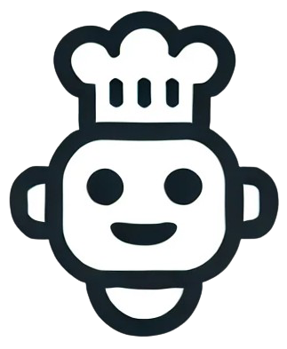

# 👨‍🍳 Chef-Claude

**Chef-Claude** is an AI-powered recipe generator that helps users cook with what they already have. Enter up to 4 ingredients, and Claude AI will suggest a personalized recipe.

---

## 🚀 Features

- 🧠 Powered by [HuggingFace Inference API](https://huggingface.co/inference-api)
- 🤖 Claude AI recipe generation (using `mistralai/Mixtral-8x7B-Instruct`)
- 🥕 Ingredient-based prompt customization
- ⚛️ Built with React + Vite
- 📦 Clean component structure: `App`, `IngredientsList`, `ClaudeRecipe`, `Header`

---

## 🧪 Demo

> Not deployed yet. To run locally, see below 👇

---

## ⚙️ Technologies Used

- React (with Hooks)
- Vite (for fast dev experience)
- HuggingFace Inference SDK
- Modern JavaScript (ES6+)

---

## 📁 Project Structure

src/
├── assets/
│ └── Chef-Claude.png
├── components/
│ ├── ClaudeRecipe.jsx
│ ├── IngredientsList.jsx
│ └── Header.jsx
├── App.jsx
├── aijs.js # Handles the AI interaction logic
├── main.jsx
├── index.jsx
├── index.css

🧠 Setup Environment Variables
This app uses HuggingFace Inference API. You’ll need your own API token.

1. Go to https://huggingface.co/settings/tokens

2. Create a new token (with read access)

3. Create a .env file in the root of the project.

🔍 Usage
Start the development server:

1. Enter up to 4 ingredients (e.g., rice, eggs, spinach, garlic)

2. Click "Get Recipe"

3. Wait for Claude to respond with a recipe you can make!
